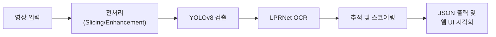

<div align="center">

# 🚔 DeepTracer
### On-prem Blackbox Video Forensic AI

[](https://www.python.org/)
[]()

<p align="center">
  <b>대량의 블랙박스·CCTV 영상을 자동으로 분석하여 차량 및 번호판을 탐지하는<br>
  온프레미스 디지털 포렌식 AI 플랫폼입니다.</b>
</p>

</div>

---

## 📖 소개 (Introduction)

**DeepTracer**는 수사 및 디지털 포렌식 업무의 효율성을 극대화하기 위해 개발되었습니다. YOLOv8 기반의 객체 검출과 LPRNet 기반의 번호판 인식을 결합하여, 특히 **한국형 번호판 환경에 최적화된 분석 성능**을 제공합니다.

보안이 중요한 수사 환경을 고려하여 외부 네트워크 연결 없이 작동 가능한 **온프레미스(On-premise)** 환경을 지원하며, 직관적인 웹 UI를 통해 누구나 쉽게 분석 결과를 확인할 수 있습니다.

## ✨ 주요 기능 (Key Features)

* 🎥 **자동 검출 및 인식**: 블랙박스·CCTV 영상에서 차량과 번호판을 자동으로 식별하고 텍스트로 변환합니다.
* 🔍 **스마트 검색**: 타임라인 기반 검색 기능을 통해 특정 시간대의 이벤트를 빠르게 찾을 수 있습니다.
* 📂 **데이터 시각화 및 내보내기**: 프레임 단위의 상세 정보를 제공하며, 분석 결과는 JSON 형식으로 다운로드 가능합니다.
* 🔒 **온프레미스 웹 UI**: 보안망 환경에서도 브라우저만으로 접근 가능한 웹 인터페이스를 제공합니다.

---

## 🏗 아키텍처 (Architecture)

### 시스템 파이프라인

---

## 🛠 기술 스택 (Tech Stack)

### AI & ML


### Backend


### Frontend


### Infrastructure (Local & Cloud)


### Database & Monitoring


---

## 📊 성능 요약 (Performance)

* **번호판 검출 정확도 (Precision)**: **94.4%**
* **번호판 검출 재현율 (Recall)**: **94.5%**
* **번호판 인식 정확도 (Plate-level Accuracy)**: **91.58%**
* **OCR 정확도 (LPRNet)**: **92.1% ~ 98.05%**
* **평균 처리 속도**: 약 4~5 FPS (FHD 29.97fps 기준)

---

## 🚀 로드맵 (Roadmap)

### Phase 1: 기본 기능 확대
- [ ] 다양한 차종 분류 및 색상 인식
- [ ] 차량 추적(Tracking) 및 이동 경로 시각화
- [ ] 대량 영상 배치 처리 최적화

### Phase 2: 멀티모달 분석
- [ ] **음성 인식(STT)**: 영상 내 음성 자동 추출 및 텍스트 변환
- [ ] **GPS & 지도 연동**: 차량 이동 경로를 지도 위에 실시간 표시
- [ ] **메타데이터 통합**: 외부 데이터(교통 정보, 사건 기록 등) 연계 분석

### Phase 3: 고급 기능
- [ ] **행동 인식**: 과속, 급회전 등 운전 행동 자동 감지
- [ ] **사건 타임라인 시각화**: 관련 영상들의 시간축 연동 분석
- [ ] **AI 기반 이상 탐지**: 수상한 행동 패턴 자동 감지

### Phase 4: 인프라 & 성능 강화
- [ ] 저해상도·야간 환경 인식률 개선 (Image Enhancement)
- [ ] 모션블러 강건성 향상
- [ ] CI/CD 파이프라인 구축 및 자동 스케일링

---

## 💻 설치 및 실행 (Installation & Usage)

> **⚠️ 현재 구현 진행 중 (WIP)**
>
> 아래 내용은 구현 완료 후 업데이트될 예정입니다.

### 요구사항 (Requirements)
> **⚠️ 현재 구현 진행 중 (WIP)**
>
> 아래 내용은 구현 완료 후 업데이트될 예정입니다.

* Python 3.8+
* GPU (NVIDIA CUDA 11.0+ 권장)
* RAM: 8GB (최소) / 16GB (권장)
* Storage: 5GB+ (모델 가중치 포함)

### 기본 설치
```bash
# 리포지토리 클론
git clone [https://github.com/DeepTracer/DeepTracer.git](https://github.com/DeepTracer/DeepTracer.git)
cd DeepTracer

# 가상환경 생성 및 활성화
python -m venv venv
source venv/bin/activate  # Linux/Mac
# venv\Scripts\activate  # Windows

# 의존성 설치
pip install -r requirements.txt

# 모델 가중치 다운로드
python scripts/download_models.py
```
### 실행 방법 (Execution)

**Local Development**
```bash
# 1. 백엔드 서버 실행
python -m uvicorn main:app --reload --host 0.0.0.0 --port 8000

# 2. 프론트엔드 서버 실행 (새 터미널)
cd frontend
npm start
```
> **⚠️ 현재 구현 진행 중 (WIP)**
>
> 아래 내용은 구현 완료 후 업데이트될 예정입니다.

*브라우저 접속: http://localhost:3000*

### Docker Environment
```bash
docker-compose up -d
```

## 👥 팀 (Team)

| 이름 | 역할 | GitHub | 연락처 |
| :---: | :--- | :---: | :--- |
| **정장우** | BE/INFRA | [@Smallt0wn](https://github.com/Smallt0wn) | smalltown1@gachon.ac.kr |
| **최재경** | AI/RESEARCH | [@siugell](https://github.com/siugell) | chlworud0722@gachon.ac.kr |
| **김용진** | FE/RESEARCH | [@YongJin04](https://github.com/YongJin04) | yj20040813@gachon.ac.kr |

## 📄 라이선스 (License)

> ⚠️ **라이선스 정보는 구현 완료 후 추가될 예정입니다.**

본 프로젝트는 `[라이선스 선택 예정]`에 따라 배포됩니다. 자세한 내용은 `LICENSE` 파일을 참조하세요.

---

<br>
<p align="center">
  문의 사항이 있으신 경우, 상단의 팀 정보를 통해 연락 주시기 바랍니다.
</p>
