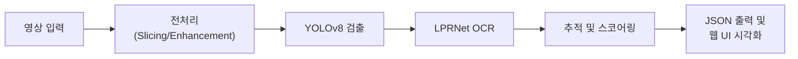
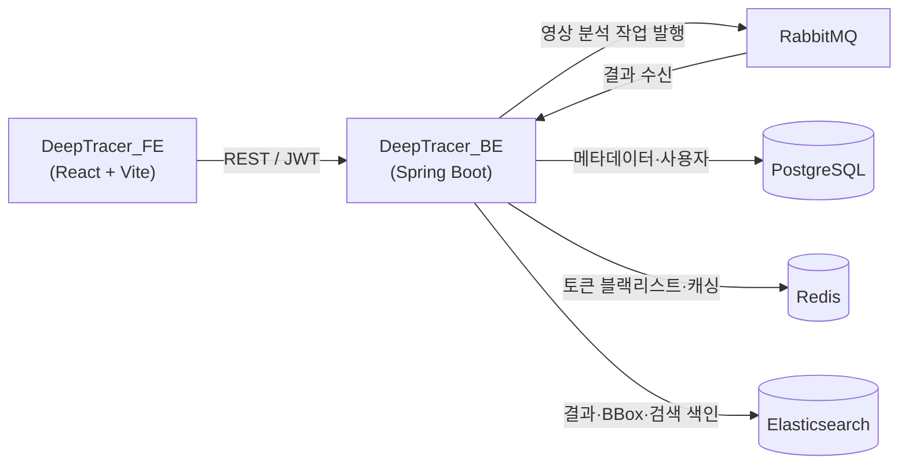

<div align="center">

<h1>  DeepTracer </h1>

### On-prem Blackbox Video Forensic AI Tool & platform

[](https://openjdk.org/)
[](https://spring.io/projects/spring-boot)
[](https://react.dev/)
[](https://www.python.org/)
[]()

<p align="center">
  <b>대량의 블랙박스·CCTV 영상을 자동으로 분석하여 차량 및 번호판을 탐지하는<br>
  온프레미스 디지털 포렌식 AI 플랫폼입니다.</b>
</p>

</div>

---

## 📖 소개 (Introduction)

**DeepTracer**는 수사 및 디지털 포렌식 업무의 효율성을 극대화하기 위해 개발되었습니다. YOLOv8 기반의 객체 검출과 LPRNet 기반의 번호판 인식을 결합하여, 특히 현재는 **한국형 번호판 환경에 최적화된 분석 성능**을 제공합니다.

보안이 중요한 수사 환경을 고려하여 외부 네트워크 연결 없이 작동 가능한 **온프레미스(On-premise)** 환경을 지원하며, 분석 결과는 데이터 계층화를 통해 보안이 보장된 상황에서 직관적인 온라인 웹 UI를 통해 누구나 쉽게 분석 결과를 확인할 수 있습니다.

## ✨ 주요 기능 (Key Features)

*  **자동 검출 및 인식**: 블랙박스 영상에서 차량과 번호판을 자동으로 식별하고 텍스트로 변환합니다.
*  **스마트 검색**: 타임라인 기반 검색 기능 및 키워드 기반 검색을 통해 특정 시간대의 이벤트 혹은 원하는 특정 대상을 빠르게 찾을 수 있습니다.
*  **데이터 시각화 및 내보내기**: 프레임 단위의 상세 정보를 제공하며, 분석 결과는 JSON 형식으로 다운로드 가능합니다
*  **온프레미스 로컬 UI**: 보안망 환경에서도 브라우저만으로 접근 가능한 로컬 인터페이스를 제공합니다.
*  **보안 환경 구축**: 데이터 계층화를 통해 로컬 및 클라우드 환경에서 사용자에게 편리한 서비스를 제공합니다.

---

## 🗂 레포지토리 구성 (Repository Structure)

| 디렉터리 | 설명 | 주요 스택 |
| :--- | :--- | :--- |
| `DeepTracer_BE` | 영상 분석 파이프라인 백엔드 API 서버 | Spring Boot, PostgreSQL, Redis, RabbitMQ, Elasticsearch |
| `DeepTracer_FE` | 분석 결과 조회·검색 웹 대시보드 | React, TypeScript, Vite, TailwindCSS |
| `DeepTracer_AI` | 차량/번호판 검출 및 OCR 추론 모듈 | YOLOv8, LPRNet, PyTorch |
| `DeepTracer_APP` | 로컬 데스크톱 분석 애플리케이션 | Python |

---

## 🏗 아키텍처 (Architecture)

### 시스템 파이프라인

```mermaid

graph LR
    A[영상 입력] --> B["전처리<br/>(Slicing/Enhancement)"]
    B --> C[YOLOv8 검출]
    C --> D[LPRNet OCR]
    D --> E[추적 및 스코어링]
    E --> F["JSON 출력 및<br/>웹 UI 시각화"]
```

### 서비스 구성 (Backend ↔ Frontend)

```mermaid
graph LR
    FE["DeepTracer_FE<br/>(React + Vite)"] -->|REST / JWT| BE["DeepTracer_BE<br/>(Spring Boot)"]
    BE -->|영상 분석 작업 발행| MQ["RabbitMQ"]
    MQ -->|결과 수신| BE
    BE -->|메타데이터·사용자| PG[("PostgreSQL")]
    BE -->|토큰 블랙리스트·캐싱| RD[("Redis")]
    BE -->|결과·BBox·검색 색인| ES[("Elasticsearch")]
```

### 인프라 아키텍쳐
> **⚠️ 현재 구현 진행 중 (WIP)**
>
> 아래 내용은 구현 완료 후 업데이트될 예정입니다.


---

## 🛠 기술 스택 (Tech Stack)

### AI & ML


### Backend


> 도메인 중심(DDD) 패키지 구조(`auth`, `video`, `analysis`, `result`, `media`)로 구성되어 있으며,
> JWT 기반 인증, RabbitMQ 기반 영상 분석 작업 큐, Elasticsearch 기반 결과 검색을 제공합니다.

### Frontend


> 대시보드·영상 상세·타임라인·검색·인증(로그인/회원가입) 화면을 제공하며, 다크 모드를 지원합니다.

### Message Queue & Search


### Database & Cache


### Infrastructure

> **⚠️ Nginx / GCP / Kubernetes 등 배포 인프라는 구현 진행 중 (WIP)이며, 완료 후 업데이트될 예정입니다.**

---

## 📊 성능 요약 (Performance)

* **번호판 검출 정확도 (Precision)**: **94.4%**
* **번호판 검출 재현율 (Recall)**: **94.5%**
* **번호판 인식 정확도 (Plate-level Accuracy)**: **91.58%**
* **OCR 정확도 (LPRNet)**: **92.1% ~ 98.05%**
* **평균 처리 속도**: 약 4~5 FPS (FHD 29.97fps 기준)

---

## 🚀 로드맵 (Roadmap)

### Phase 1: 기본 기능 확대
- [ ] 다양한 차종 분류 및 색상 인식
- [ ] 차량 추적(Tracking) 및 이동 경로 시각화
- [ ] 대량 영상 배치 처리 최적화

### Phase 2: 멀티모달 분석 및 사용자 인터페이스 업데이트
- [ ] **음성 인식(STT)**: 영상 내 음성 자동 추출 및 텍스트 변환
- [ ] **GPS & 지도 연동**: 차량 이동 경로를 지도 위에 실시간 표시
- [ ] **메타데이터 통합**: 메타 데이터(교통 정보, 사건 기록 등) 추가 데이터와 연계 분석

### Phase 3: 인프라 & 성능 강화
- [ ] 저해상도·야간 환경 인식률 개선 (Image Enhancement)
- [ ] 모션블러 강건성 향상
- [ ] CI/CD 파이프라인 구축 및 자동 스케일링

---

## 💻 설치 및 실행 (Installation & Usage)

### 요구사항 (Requirements)

* **Backend**: Java 17, Gradle
* **Frontend**: Node.js 18+, npm
* **AI**: Python 3.8+, GPU (NVIDIA CUDA 11.0+ 권장)
* **Infra**: Docker / Docker Compose (PostgreSQL, Redis, RabbitMQ, Elasticsearch)
* RAM: 8GB (최소) / 16GB (권장)
* Storage: 5GB+ (모델 가중치 포함)

---

### 1. 인프라 실행 (Docker)

PostgreSQL, Redis, 메시지 큐(RabbitMQ), Elasticsearch를 컨테이너로 실행합니다.

```bash
cd DeepTracer_BE
docker-compose up -d
```

### 2. 백엔드 실행 (Spring Boot)

```bash
cd DeepTracer_BE

# Gradle 빌드 및 실행
./gradlew bootRun        # Linux / Mac
# gradlew.bat bootRun    # Windows
```

* 기본 포트: `http://localhost:8080`
* API 문서(Swagger UI): `http://localhost:8080/swagger-ui.html`

### 3. 프론트엔드 실행 (React + Vite)

```bash
cd DeepTracer_FE

# 의존성 설치
npm install

# 개발 서버 실행
npm run dev
```

* 브라우저 접속: `http://localhost:5173`

### 4. AI 추론 모듈 (선택)

```bash
cd DeepTracer_AI

# 가상환경 생성 및 활성화
python -m venv venv
source venv/bin/activate  # Linux/Mac
# venv\Scripts\activate   # Windows

# 의존성 설치
pip install -r requirements/requirements.txt
```

> **⚠️ 일부 실행 절차 및 모델 가중치 다운로드 방법은 구현 진행 중 (WIP)이며, 완료 후 업데이트될 예정입니다.**

---

## 👥 팀 (Team)

| 이름 | 역할 | GitHub | 연락처 |
| :---: | :--- | :---: | :--- |
| **정장우** | BE/INFRA | [@Smallt0wn](https://github.com/Smallt0wn) | smalltown1@gachon.ac.kr |
| **최재경** | AI/RESEARCH | [@siugell](https://github.com/siugell) | chlworud0722@gachon.ac.kr |
| **김용진** | FE/RESEARCH | [@YongJin04](https://github.com/YongJin04) | yj20040813@gachon.ac.kr |

## 📄 라이선스 (License)

> ⚠️ **라이선스 정보는 구현 완료 후 추가될 예정입니다.**

본 프로젝트는 `[라이선스 선택 예정]`에 따라 배포됩니다. 자세한 내용은 `LICENSE` 파일을 참조하세요.

---

<br>
<p align="center">
  문의 사항이 있으신 경우, 상단의 팀 정보를 통해 연락 주시기 바랍니다.
</p>
